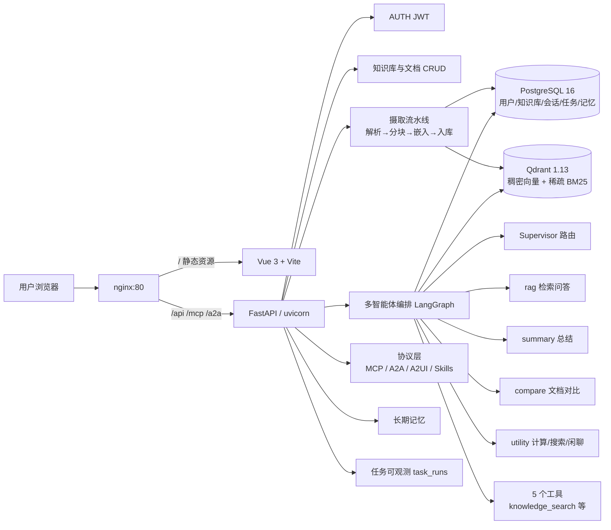

# DocAgent · 多智能体知识库问答平台

> **面向个人的多智能体 RAG 问答平台**:上传文档 → 自动解析分块入库 → 混合检索 + 重排 → Supervisor 编排四类智能体流式作答,并原生支持 MCP / A2A / A2UI / Skills / 长期记忆等 Agent 互操作协议。


---

## 核心能力

- **多智能体编排(LangGraph)**:Supervisor 把用户意图路由到 `rag` / `summary` / `compare` / `utility` 四类专用智能体;按会话维护对话记忆(InMemorySaver),按用户注入长期记忆。
- **混合检索 RAG**:稠密向量(Qdrant + SiliconFlow 嵌入)与稀疏 BM25 分数融合,经 SiliconFlow 交叉编码重排,回答带 `[1]` 引用溯源。
- **文档流水线**:一键上传 PDF / DOCX / Markdown / TXT → 解析 → 分块 → 嵌入 → 入库,文档状态机(parsing → ready / failed)可观测。
- **Agent 互操作协议**:自研 **MCP** 服务端(JSON-RPC 2.0 + SSE 传输,4 个工具)、**A2A**(Agent-to-Agent)、**A2UI**(结构化卡片),以及 **Skills** 技能加载(`SKILL.md` 声明式)。
- **流式体验**:SSE 逐 token 输出,前端实时渲染路由决策 / 节点 / 工具调用 / 引用来源。
- **可观测**:每次问答写入 `task_runs`,流式期间增量持久化 trace 事件(route/node/tool/answer…)。
- **工程化**:95 个 pytest 全绿、ruff 静态检查、GitHub Actions CI、Docker Compose 一键全链路。

## 架构总览



## 功能 ↔ AI 应用开发工程师岗位对照

| 岗位考察点 | 本项目的落点 |
| --- | --- |
| **RAG 工程落地** | 完整检索链路:文档解析(4 格式)→ 分块 → 稠密+稀疏混合检索 → 交叉编码重排 → 引用溯源;向量库选型 Qdrant、嵌入 SiliconFlow |
| **大模型应用 / 智能体编排** | LangGraph Supervisor + 4 智能体;工具调用(5 tools);会话记忆 + 用户长期记忆;`deepseek-v4-flash` 对话模型;失败回滚到 task_runs 错误记录 |
| **Agent 互操作协议** | 自研 MCP 服务端(JSON-RPC 2.0 + SSE)、A2A、A2UI 结构化卡片、Skills 技能声明,前端可直接对接 Claude Desktop 等 MCP 客户端 |
| **后端工程化** | FastAPI 分层架构、pydantic 校验、JWT 鉴权、SQLAlchemy + Alembic 迁移、结构化 JSON 日志、可观测 task_runs、依赖注入缝便于测试替身 |
| **前端对接 / SSE 流式** | Vue 3 + Vite 单页应用,`fetch` + `ReadableStream` 解析 SSE,实时渲染 agent 路由/节点/工具/引用 |
| **测试与 CI/CD** | 单测 + 集成 + 全链路 E2E 三层(95 个测试,全 fake 模型,不依赖真实 API 密钥);ruff 静态检查;GitHub Actions 多 job(后端测试 / 前端构建 / 镜像构建);Docker Compose 全链路交付 |

## 快速开始

### 方式一:Docker Compose 一键起(推荐)

```bash
cp .env.example .env     # 按需填入 DEEPSEEK_API_KEY / SILICONFLOW_API_KEY
docker compose up -d --build
# 前端  http://localhost:5173
# 后端  http://localhost:8000/api/v1/health
```

Compose 会拉起 `frontend(nginx) + backend(uvicorn) + postgres + qdrant` 四个容器,backend 启动时自动执行 `alembic upgrade head` 建表。上传文档后即可在「对话」页使用多智能体问答。

### 方式二:本地开发

**后端**(Python 3.12 + conda):

```bash
conda create -n yy python=3.12 -y && conda activate yy
pip install -r backend/requirements.txt
# 本机需有 postgres 与 qdrant;Docker 快速起两个依赖:
#   docker run -d -p 5432:5432 -e POSTGRES_USER=docagent -e POSTGRES_PASSWORD=docagent_dev_password -e POSTGRES_DB=docagent postgres:16-alpine
#   docker run -d -p 6333:6333 qdrant/qdrant:v1.13.0
cp .env.example .env
cd backend && alembic upgrade head && uvicorn app.main:app --reload --port 8000
```

**前端**(Node 20):

```bash
cd frontend && npm install && npm run dev   # http://localhost:5173,已配置 /api 代理到 8000
```

## API 一览

统一前缀 `/api/v1`(MCP / A2A 除外);除健康检查与登录注册外均需 `Authorization: Bearer <token>`。

| 模块 | 方法与路径 | 说明 |
| --- | --- | --- |
| 健康 | `GET /health` | 服务健康检查 |
| 认证 | `POST /auth/register` · `POST /auth/login` · `GET /auth/me` | 注册 / 登录(JWT)/ 当前用户 |
| 知识库 | `GET|POST /knowledge_bases` · `GET|PATCH|DELETE /knowledge_bases/{kb_id}` | 知识库 CRUD |
| 文档 | `POST /knowledge_bases/{kb_id}/documents` | 上传文档,后台摄取 |
| 文档 | `GET /knowledge_bases/{kb_id}/documents` · `GET|DELETE /documents/{doc_id}` | 列表 / 详情(含状态与分块数)/ 删除 |
| 对话 | `POST /chat` | 同步 RAG 问答 |
| 对话 | `POST /chat/agent` | **SSE 多智能体流式问答**(route/node/token/tool/answer/sources/done) |
| 会话 | `GET /conversations` · `GET /conversations/{conv_id}/messages` | 会话与消息(含溯源) |
| 技能 | `GET /skills` | 列出可加载 Skills |
| A2UI | `POST /a2ui/render` · `GET /a2ui/cards/{message_id}` | 渲染结构化卡片 / 回取卡片 |
| 长期记忆 | `POST|GET /memories` · `GET /memories/search` · `DELETE /memories/{memory_id}` | 记忆写入 / 列出 / 语义检索 / 删除 |
| 任务可观测 | `GET /task_runs` · `GET /task_runs/{run_id}` | 运行列表 / trace 事件详情 |
| **MCP** | `POST /mcp`(JSON 或 SSE) | 自研 MCP 服务端:initialize / tools/list / tools/call |
| **A2A** | `POST /a2a` | Agent-to-Agent 问答 |

## 目录结构

```
.
├── backend/
│   ├── app/
│   │   ├── api/            # HTTP 路由层(含 /mcp、/a2a、/a2ui 协议入口)
│   │   ├── agents/         # LangGraph Supervisor + 4 智能体、5 工具、路由
│   │   ├── rag/            # 解析/分块/嵌入/向量库/稀疏BM25/重排
│   │   ├── protocols/      # MCP 服务端、A2A、A2UI 卡片、Skills
│   │   ├── services/       # 摄取、agent 编排、记忆 业务服务
│   │   ├── models/         # SQLAlchemy 模型(User/KB/Document/Chunk/Message/TaskRun/Memory…)
│   │   ├── core/           # 配置、安全(JWT)、结构化日志
│   │   ├── alembic/        # 数据库迁移
│   │   └── main.py         # App factory
│   ├── skills/             # rag_qa / web_research(SKILL.md 声明式)
│   ├── tests/              # 95 个测试(单测/集成/全链路 E2E)
│   ├── requirements.txt
│   └── Dockerfile
├── frontend/               # Vue 3 + Vite(SSE 流式对话前端)
├── docs/                   # 设计文档与里程碑计划
├── docker-compose.yml      # 全链路编排
├── ruff.toml               # ruff 静态检查配置
└── .env.example
```

## 测试与 CI

- **测试**:`backend/tests/` 共 95 个,分三层 —— 单元测试(解析/分块/稀疏/路由/工具)、集成测试(鉴权/知识库/对话/协议)、全链路 E2E(注册→登录→建库→上传→SSE 问答→溯源→任务→记忆→A2UI)。**所有测试注入 fake 模型/嵌入,不消耗真实 API 密钥。**
- **静态检查**:`ruff check backend`(E/F/I/B/RUF 规则集,含 FastAPI 依赖注入豁免)。
- **CI**(`.github/workflows/ci.yml`):
  - `backend-tests`:起 postgres + qdrant 服务容器,Python 3.12 跑 pytest;
  - `frontend-build`:Node 20 执行 `npm ci && npm run build`;
  - `docker-build`:构建前后端镜像;
  - `lint`:`ruff check backend`。

## 配置说明

复制 `.env.example` 为 `.env`(本地或 compose 注入);`backend/app/core/config.py` 读取全部配置。

| 变量 | 说明 |
| --- | --- |
| `DEBUG` | 调试开关 |
| `SECRET_KEY` | JWT 签名密钥,生产必须更换 |
| `POSTGRES_*` | PostgreSQL 连接(用户/密码/库名/主机/端口) |
| `QDRANT_URL` | Qdrant 地址(compose 内为 `http://qdrant:6333`) |
| `QDRANT_COLLECTION` | 生产集合名(测试用 `docagent_test_collection`,不污染) |
| `DEEPSEEK_API_KEY` | 对话模型(`deepseek-v4-flash`)密钥 |
| `SILICONFLOW_API_KEY` | 嵌入 / 重排模型密钥 |

## 未来计划

- 迁移到 PostgreSQL `pgvector` 或在 Qdrant 上补充过滤检索(按标签/时间);
- 引入 `langgraph-checkpoint` 持久化会话(当前为 InMemorySaver,单进程);
- 为更多格式添加解析器(网页抓取、扫描件 OCR);
- 前端接入 Vue Router / Pinia 完善多页体验,补充管理员后台。

---

*一个用于 AI 应用开发工程师求职展示的完整作品:从 RAG 到多智能体、从协议工程到工程化交付。*
